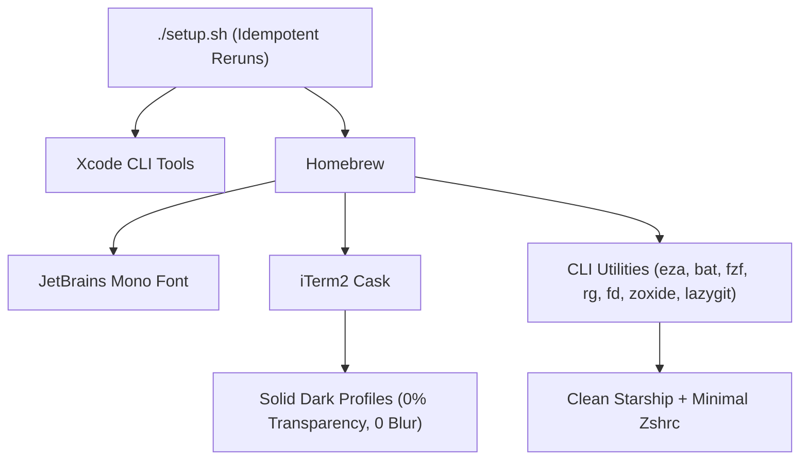

# Clean macOS Developer & iTerm2 Setup Guide

Location: `/Users/eal/dev/guide/iterm-setup`

---

## Architecture & Configuration

### 1. iTerm2 Configuration (`config/iterm2/dynamic_profiles.json`)
- **Solid background**: Transparency set to `0.0`, Blur disabled (`Blur: false`).
- **Typography**: JetBrains Mono Nerd Font 14pt, 1.0 vertical/horizontal spacing.
- **Cursor**: Solid block cursor, non-blinking.
- **Scrollback**: 10,000 lines.
- **Color Profiles**: Clean slate dark (`Default`) and high-contrast dark (`Clean Dark`), plus standard presets.

### 2. Prompt (`config/starship.toml`)
- Distraction-free single-line format: `$directory$git_branch$git_status$cmd_duration$character`
- Full PWD displayed on the same line preceding the prompt (`~/dev/guide git:main ❯`), without line breaks or repo-root truncation (`truncate_to_repo = false`, `truncation_length = 0`).
- No emoji clutter, no language badges on every empty line.
- Plain symbols: `git:main`, `+` (staged), `!` (modified), `?` (untracked).

### 3. Shell & Aliases (`config/zshrc`)
- `ls`, `ll`, `la` mapped to `eza` with `--group-directories-first` (no icon clutter).
- `cat` mapped to `bat --style=numbers,changes` with native ANSI colors.
- `z` mapped to `zoxide` for fast directory navigation.
- `Ctrl+R` / `Ctrl+T` mapped to `fzf` without invasive borders.
- Safe backup of existing `~/.zshrc` preserved before writes.
