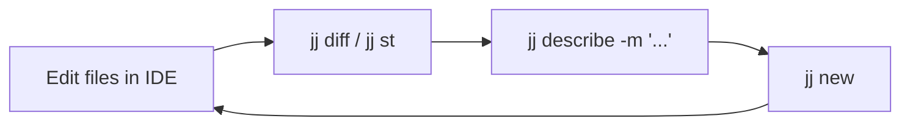

# Jujutsu (`jj`) Developer Field Guide

A practical, distraction-free reference manual for developers using `jj` on top of Git.

---

## 1. Core Mental Model

```
Traditional Git:
  Working Directory  --->  Staging Area (git add)  --->  Commit Object (git commit)

Jujutsu (jj):
  Working Directory IS the Current Commit (@)
```

- **No Staging Area**: File changes are automatically recorded in the current working copy commit (`@`).
- **Working Copy is Mutable**: The `@` revision automatically updates whenever you save files in your editor.
- **Two Identifiers for Every Change**:
  - **Change ID** (e.g., `kkmpptxz`): Identifies the logical unit of work. It remains stable across amends, rebases, and squashes.
  - **Commit ID** (e.g., `a1b2c3d`): The cryptographic hash (Git SHA). Changes whenever contents or parents change.
- **Bookmarks = Git Branches**: In `jj`, Git branches are called `bookmarks`.

---

## 2. Repository Setup

### Colocate on an Existing Git Repo
Run inside your existing Git project folder:
```bash
jj git init --colocate
```
*(Both `.git` and `.jj` will live side-by-side in the same directory).*

### Clone a Remote Repo with `jj`
```bash
jj git clone --colocate https://github.com/user/repo.git
```

### Identity Configuration
```bash
jj config set --user user.name "Evan Leonard"
jj config set --user user.email "evan.leonard@gmail.com"
```

---

## 3. Daily Workflow Loop



### 1. View Status and Diffs
```bash
jj st           # Compact status showing modified files and parent revisions
jj diff         # Full unified diff of the current working copy (@)
jj diff -r <id> # Diff of a specific past revision
```

### 2. Add or Edit Commit Message
```bash
jj describe -m "Add authentication route"
# Or just run `jj describe` to edit the message in your configured text editor.
```

### 3. Finalize and Start Next Task
```bash
jj new
```
This finalizes your current work and opens a clean, empty working copy commit on top of it.

---

## 4. Working with Remotes & GitHub (Bookmarks)

### Create a Branch (Bookmark)
```bash
jj bookmark create feat-auth
```

### Push to Remote
```bash
# Push specific bookmark to origin
jj git push --bookmark feat-auth

# Push all tracked bookmarks
jj git push
```

### Move a Bookmark to the Current Commit
```bash
jj bookmark set feat-auth -r @
```

### Fetch Remote Changes
```bash
jj git fetch
```

---

## 5. Rewriting History (Without Interactive Rebase)

### Superpower 1: Instant Undo
Every single command is written to an internal operation log:
```bash
jj undo
```
*(Running `jj undo` multiple times steps backwards through previous states).*

View operation history:
```bash
jj op log
```

### Superpower 2: Edit Any Past Revision
```bash
jj log                    # Find the change ID (e.g. mzvwutno)
jj edit mzvwutno          # Check out that past revision as the working copy (@)
# ... make your edits in your editor ...
jj new                    # Return to the top of your stack
```
All child commits downstream automatically rebase themselves without manual conflict replay.

### Superpower 3: Squash Changes
Absorb current working copy edits into the commit directly beneath it:
```bash
jj squash
```

Squash into a specific revision anywhere in history:
```bash
jj squash --into <change-id>
```

### Superpower 4: Discard / Abandon
Throw away the current commit and move to a clean state:
```bash
jj abandon
```

---

## 6. Git vs. `jj` Rosetta Stone

| Task | Git Command | `jj` Equivalent |
| :--- | :--- | :--- |
| **Inspect status** | `git status` | `jj st` |
| **Inspect diff** | `git diff` | `jj diff` |
| **View revision graph** | `git log --graph --oneline` | `jj log` |
| **Set message** | `git commit -m "..."` | `jj describe -m "..."` |
| **Commit & start next** | `git add . && git commit` | `jj new` |
| **Create branch** | `git branch <name>` | `jj bookmark create <name>` |
| **Switch branch** | `git checkout <name>` | `jj edit <name>` |
| **Push branch** | `git push -u origin <name>` | `jj git push -b <name>` |
| **Fetch remote** | `git fetch` | `jj git fetch` |
| **Undo last operation** | `git reflog` + `git reset` | `jj undo` |
| **Discard current edits** | `git restore .` | `jj abandon` |
| **Absorb fix into parent** | `git commit --fixup` + autosquash | `jj squash` |

---

## 7. Useful Flags & Aliases

Add these aliases to your `~/.zshrc` for faster navigation:

```bash
alias jst='jj status'
alias jlog='jj log'
alias jdiff='jj diff'
alias jdesc='jj describe'
alias jnew='jj new'
alias jundo='jj undo'
alias jju='jjui'
```

---

## 8. Visual Apps & GUIs

### Terminal UI: `jjui` (Recommended)
`jjui` is an interactive TUI (analogous to `lazygit` for Git) designed specifically for Jujutsu.
* **Launch**: `jjui` (or `jju`)
* **Features**:
  * Visual, interactive revision DAG navigation.
  * Fast keyboard shortcuts to rebase, squash, describe, split, and abandon commits.
  * Inline diff viewer with syntax highlighting.
* **Install**: `brew install jjui`

### Desktop GUI: `GG`
`GG` is a dedicated graphical application for Jujutsu workflows.
* **Launch**: `gg` or launch `GG.app` from Spotlight / Applications
* **Features**:
  * Drag-and-drop rebasing of change stacks.
  * Full inspection of commit metadata, diffs, and the operation log (`jj op log`).
* **Install**: `brew install --cask gg`
